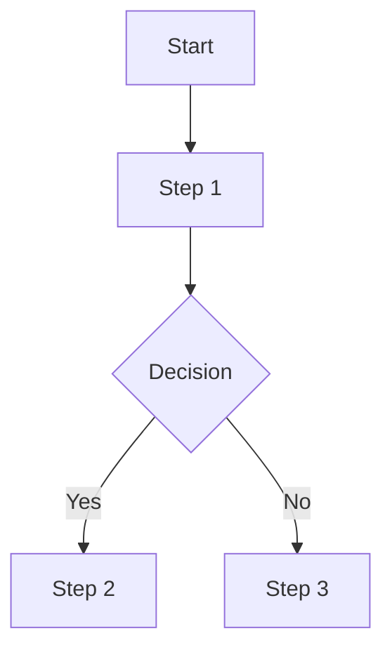

# FSD Blueprint

Reference for composing a Functional Specification Document. Each section specifies what content goes there, the required format, and internal Questions to Ask (use during Excavation — do not surface verbatim to the user).

The FSD carries forward traceability IDs defined in the BRD (BO, FE, LI, AS, DE). It may introduce new FE or LI items if design reveals scope not captured in the BRD.

---

## Document Boilerplate

Same as BRD: Document Info table, Revision History, Approval page, Table of Contents, Lists of Tables and Figures.

---

## 1. Introduction

### 1.1 Purpose of Project

**What goes here:** A narrative restating the business problem and how this system solves it — more technically specific than the BRD's Background. Focus on the system's purpose as a software solution.

**Format:** 2–4 prose paragraphs.

**Questions to Ask:** (internal guides for Excavation)
- What specific problem does this system solve, expressed in functional terms?
- What is the scope of the system's responsibility? What does it NOT do?
- Who are the primary beneficiaries of this system?

---

### 1.2 Project Scope

**What goes here:** Carry forward the key traceability items from the BRD — Business Objectives (BO), Assumptions (AS), Dependencies (DE), Features (FE), Limitations (LI). These provide the traceability anchor for all functional requirements that follow.

**Format:** Labeled lists.

```
BO-1: Discover and establish authoritative inventory for 95% of Shared Mailboxes.
BO-2: Successfully complete a full review cycle to baseline risk.

FE-1: Manage Asset Inventory in a Logically Separated Data Model.
FE-2: Automated Data Ingestion from Source Table.

LI-1: Remediation of revoked access is not automated.
```

**Do not repeat the full BRD context.** Extract only the traceability items. The reader goes to the BRD for the full narrative.

---

### 1.3 Related Documents

**What goes here:** Table of related documents (BRD, TSD, architectural docs, API specs).

| No | Document Name | Description |
|---|---|---|
| 1 | BRD — [Project Name] | Business requirements defining objectives, scope, and context |

---

### 1.4 Glossary

**What goes here:** Terms and abbreviations specific to this project.

| No | Abbreviation | Definition | Description |
|---|---|---|---|
| 1 | BO | Business Objectives | Defines objectives of business process |
| 2 | FE | Features | List of features in scope |

---

## 2. Business Process Overview

### 2.1 User Roles and Responsibilities

**What goes here:** Table of user classes, their system role mapping, and their responsibilities.

| No | User Class | System Role | Responsibility |
|---|---|---|---|
| 1 | System Administrator | Super Admin | Manages all configurations and campaigns |
| 2 | Asset Owner | User | Reviews assigned assets, confirms ownership, certifies access |
| 3 | Auditor | User (Read-only) | Views dashboards, generates audit reports |

**Questions to Ask:**
- Who are the distinct user types?
- What can each user type do in the system?
- Are there permission levels within roles?
- Do external actors (system processes) count as users?

---

### 2.2 Business Process Diagrams

**What goes here:** One subsection per key business process or use case. Each contains a process description, a Mermaid flowchart, and a detailed step table.

**Structure per process:**

```
#### 2.2.N [Process Name]

**Description:** 2–4 sentences explaining the process goal, trigger, and outcome.

**Process Flow:**


**Detailed Process Steps:**

| No | Process Name | Role | Detailed Process |
|---|---|---|---|
| 1 | Create Campaign | Admin | Admin accesses Campaign Management and creates a new campaign |
| 2 | Configure Campaign | Admin | Admin defines details, applies scope filters, selects review stages |
| 3 | Launch Campaign | Admin | System displays summary; Admin reviews and confirms |
```

**Questions to Ask per process:**
- What is the "happy path" for this workflow?
- What decisions or branches exist?
- What can go wrong at each step?
- Who performs each step? What does the system do automatically?
- What preconditions must be satisfied before this flow starts?
- What is the postcondition — what state is the system in when the flow completes?

---

## 3. Functional Requirements / System Design

Organized by module or feature, following the FE-ID order from the scope section.

### 3.N [Module/Feature Name]

Each module section contains:

#### 3.N.1 Business Rules

**What goes here:** Numbered list of rules, constraints, and logic that govern this feature. Rules are specific, testable, and unambiguous.

```
1. User enters username/email and password, which are Azure AD credentials.
2. The authentication process uses Azure Active Directory.
3. Session timeout occurs after 15 minutes of inactivity.
```

#### 3.N.2 Screen / UI Design

**What goes here:** Description of each screen or UI element in this module. Include wireframe descriptions, field definitions, and user interaction patterns. Use Mermaid for simple UI layouts if helpful, otherwise prose + tables.

```
**Login Page:**
- Header: Logo, application name
- Form fields: Email (text input), Password (password input), Remember me (checkbox)
- Actions: Sign In button, Forgot Password link
- Validation: Email format, non-empty password, captcha
- Error states: Invalid credentials message, account locked message
```

If screen mockups exist, reference them: `[Image: Login Page mockup — see design assets]`

#### 3.N.3 Input / Output / Flow

**What goes here:** For each feature, the data inputs, expected outputs, and process flow.

```
**Input:** Username, password
**Output:** Authentication token or error message
**Flow:**
1. User enters credentials
2. System validates against identity provider
3. On success, system issues token and redirects to dashboard
4. On failure, system returns error message
```

**Questions to Ask per module:**
- What does the user see when they arrive at this screen?
- What fields, buttons, and navigation elements are present?
- What validation rules apply to each input field?
- What happens on success? What happens on error?
- Are there role-based differences in what's shown?
- What business logic runs behind the scenes?
- How does this module interact with other modules?

---

## 4. Non-Functional Requirements

### 4.1 Performance

| Requirement | Target |
|---|---|
| Page load time | < 2 seconds |
| API response time (p95) | < 500ms |
| Concurrent users | [number] |
| Availability SLA | 99.5% |

### 4.2 Security

- Authentication method (SSO, OAuth, LDAP, local)
- Password policy (length, complexity, rotation)
- Session management (timeout, refresh)
- Data encryption (in transit, at rest)
- Audit logging requirements

### 4.3 Usability

- Supported languages
- Accessibility compliance (WCAG level)
- Mobile responsiveness
- Training requirements / user onboarding

### 4.4 Compatibility

| Dimension | Supported |
|---|---|
| Browsers (Web) | Chrome, Firefox, Edge (last 2 versions) |
| Mobile OS | iOS 15+, Android 12+ |
| Screen sizes | Responsive, down to 320px width |

---

## 5. Testing Strategy (Optional)

- Unit testing expectations
- Integration testing approach
- User Acceptance Testing (UAT) criteria
- Performance/load testing targets
- Test environment requirements

---

## 6. Appendix

Additional material: screen mockup references, detailed business rules, data dictionaries.
