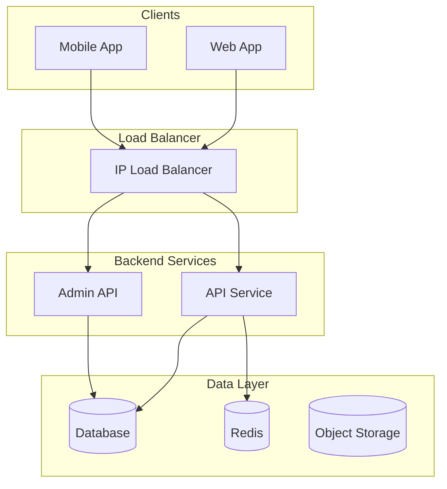
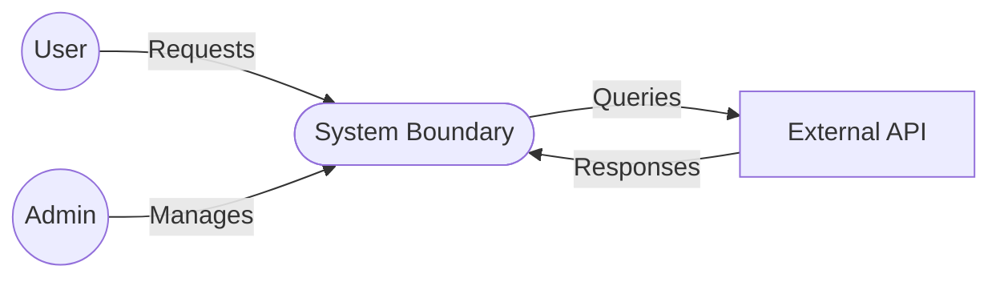
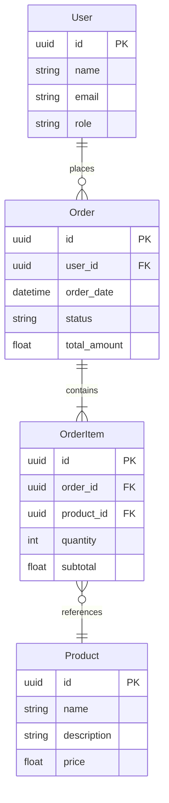

# TSD Blueprint

Reference for composing a Technical Design Document. Each section specifies what content goes there, the required format, and internal Questions to Ask (use during Excavation — do not surface verbatim to the user).

The TSD carries forward traceability IDs from the BRD (BO, FE, LI, AS, DE). It may introduce new FE or LI items if design reveals scope not captured in the BRD.

---

## Document Boilerplate

Same as BRD: Document Info table, Revision History, Approval page, Table of Contents, Lists of Tables and Figures.

---

## 1. Introduction

### 1.1 Purpose of Document

**What goes here:** State that this document describes the technical design, architecture, and implementation approach for the system. Reference the BRD and FSD as upstream documents.

### 1.2 Project Scope

**What goes here:** Carry forward traceability items from BRD (BO, FE, LI, AS, DE). Same pattern as FSD — extract only the IDs and one-line descriptions.

### 1.3 System Overview

**What goes here:** Brief (2–3 sentence) summary of the system. What it does, who uses it, and what the technical boundaries are.

---

## 2. General System Description

### 2.1 System Architecture

**What goes here:** High-level architecture description. Include a Mermaid architecture diagram and a technology stack table.



**Technology Stack:**

| Layer | Technology | Version |
|---|---|---|
| Frontend (Web) | Nuxt.js / Vue.js | [version] |
| Frontend (Mobile) | Flutter / React Native | [version] |
| Backend | .NET Core / Go / Node.js | [version] |
| Database | SQL Server / PostgreSQL | [version] |
| Cache | Redis | [version] |
| Message Broker | SignalR / RabbitMQ | [version] |
| Logging | Serilog / ELK | [version] |
| Auth | Azure AD / SSO | — |
| Deployment | Kubernetes / Docker | [version] |
| Object Storage | MinIO / S3 | [version] |

### 2.2 Architecture Diagram (if multiple views needed)

Context diagram, container diagram, or deployment diagram — each as a Mermaid block.

**Questions to Ask:**
- What is the overall architecture style (monolith, microservices, serverless)?
- What are the major subsystems and how do they communicate?
- What is the tech stack per layer?
- How is authentication handled?
- What infrastructure is required (servers, cloud, databases)?
- Are there third-party services or APIs involved?

---

## 3. System Design

### 3.1 Data Flow

#### 3.1.1 Context Diagram

**What goes here:** System boundary showing external actors (users, external systems) and the data flows between them and the system. Use Mermaid.



#### 3.1.2 Data Flow Diagram (Level 1)

**What goes here:** Internal processes, data stores, and data flows. Can be split per major subsystem.

### 3.2 Database Design

#### 3.2.1 Conceptual Data Model

**What goes here:** Entity-Relationship Diagram using Mermaid `erDiagram`.



#### 3.2.2 Physical Data Model

**What goes here:** Detailed table specifications. Each table gets a row in a master table list, with column details.

| Table | Schema | Column | Data Type | Length | Mandatory | PK | FK |
|---|---|---|---|---|---|---|---|
| Users | dbo | UserId | uniqueidentifier | — | Yes | Yes | — |
| Users | dbo | UserName | varchar | 250 | Yes | — | — |
| Users | dbo | Email | varchar | 250 | Yes | — | — |
| Orders | dbo | OrderId | uniqueidentifier | — | Yes | Yes | — |
| Orders | dbo | UserId | uniqueidentifier | — | Yes | — | Yes → Users |

**Questions to Ask:**
- What are the core entities?
- What are the relationships between them?
- What are the key attributes per entity?
- What is the primary key strategy (UUID, auto-increment)?
- What indexes are needed?
- What are the data types and sizes?
- Are there soft-delete, audit, or versioning columns?

### 3.3 API Design

#### 3.3.1 API Endpoints

**What goes here:** List of all API endpoints, grouped by domain. For each: method, path, description, request/response format.

| No | Title | Endpoint | Method | Description |
|---|---|---|---|---|
| 1 | List.Campaigns | /campaigns/list | POST | List all campaigns with filtering |
| 2 | Create.Campaign | /campaigns/create | POST | Create a new campaign |
| 3 | Read.Campaign | /campaigns/read/{id} | GET | Get campaign details |

#### 3.3.2 Request/Response Format

**What goes here:** Representative examples for common endpoint patterns.

```
// List endpoint
POST /campaigns/list
Request:
{
  "filter_where": "",
  "filter_order_by": "",
  "row_per_page": 10,
  "page_index": 0
}
Response:
{
  "list": { "rows": [...], "total_page": 2, "total_rows": 12 },
  "status": "OK"
}

// Create endpoint
POST /campaigns/create
Request:
{ "name": "Q1 Governance Review", "asset_type": "mailbox" }
Response:
{ "id": 42, "status": "OK" }
```

#### 3.3.3 Authentication and Authorization

**What goes here:** The auth mechanism (JWT, OAuth, API keys), token format, how roles/permissions map to API access.

**Questions to Ask:**
- What are the API domains/modules?
- Is the API RESTful, GraphQL, or RPC-style?
- What is the request/response format (JSON, XML, protobuf)?
- How is pagination handled?
- How is auth handled (JWT, OAuth, API keys)?
- Are there rate limits?
- What are the error response conventions?

### 3.4 Tools and Technology Architecture

**What goes here:** Programming languages, frameworks, libraries, and development tools used.

| Category | Tool |
|---|---|
| Language (Mobile) | Flutter / Kotlin / Swift |
| Language (Web) | TypeScript / JavaScript |
| Language (Backend) | Go / C# / Python |
| Framework (Web) | Vue.js / Nuxt / React |
| Framework (Backend) | .NET Core / Gin / Express |
| Dev Tools | Visual Studio Code, JetBrains, SonarQube |
| CI/CD | GitHub Actions / Jenkins |
| Repository | GitHub / GitLab / Azure DevOps |

### 3.5 Security Architecture

#### 3.5.1 Threats and Risks

**What goes here:** Security threats relevant to this system, with monitoring metrics and alert thresholds.

| Metric | Threshold |
|---|---|
| CPU usage | > 80% |
| Memory usage | > 85% |
| Storage | > 90% |
| API response time | > 2s |
| Error rate | > 1% |

#### 3.5.2 Security Mechanisms

- Authentication (SSO, MFA, password policies)
- Data encryption (TLS, at-rest encryption)
- Secret management (Vault, environment variables)
- Backup and recovery procedures
- Audit logging
- Network security (firewalls, VPN, WAF)

#### 3.5.3 Security Policies

- Database connection failure procedures
- Kubernetes issue response
- Storage failure procedures
- Escalation paths (Level 1 → 4)
- API issue response

**Questions to Ask:**
- What are the key security threats?
- What metrics should be monitored?
- What are the alert thresholds?
- What is the backup strategy?
- What is the recovery procedure?
- What is the escalation path for incidents?

---

## 4. Implementation Considerations

### 4.1 Development Environment

- Branch strategy (GitFlow, trunk-based)
- CI/CD pipeline description
- Build process
- Configuration management

### 4.2 Testing Environment

- Test infrastructure
- Data strategy (mock data, synthetic data)
- Testing tools (Selenium, Postman, JMeter)
- Performance testing approach

### 4.3 Production Environment

- Deployment topology
- Scaling strategy (horizontal, vertical)
- Monitoring and alerting
- Rollback plan

**If Kubernetes-specific:** Include deployment spec table.

| Deployment | CPU Request | CPU Limit | Memory Request | Memory Limit | Min Replicas | Max Replicas | HPA Metric |
|---|---|---|---|---|---|---|---|
| webadmin-api | 250m | 500m | 512Mi | 1Gi | 1 | 5 | CPU > 80% |
| mobile-api | 250m | 500m | 512Mi | 1Gi | 1 | 6 | CPU > 80% |

### 4.4 Capacity Planning

**What goes here:** Projected user load, resource calculations, scaling estimates.

| Users | Requests/min | Data Transfer | CPU (vCPU) | Memory (GB) | Instances |
|---|---|---|---|---|---|
| 100 | 1000 | 1MB | 0.23 | 1.4 | 1 |
| 500 | 5000 | 5MB | 1.15 | 7 | 2 |
| 1000 | 10000 | 10MB | 2.3 | 14 | 4 |

---

## 5. Maintenance and Support

### 5.1 Routine Maintenance

- Database maintenance (index rebuilds, vacuum)
- Kubernetes cluster maintenance
- Object storage maintenance
- Secret store maintenance
- Application updates

### 5.2 Support Contacts

| Level | Team | Responsibility |
|---|---|---|
| L1 | Operations | Initial triage |
| L2 | Platform Engineering | Infrastructure issues |
| L3 | Development Team | Code/application issues |
| L4 | System Architect | Escalation |

---

## 6. Appendix

- Full API documentation
- ERD diagrams
- Configuration files
- Deployment runbooks
- Additional architecture diagrams
